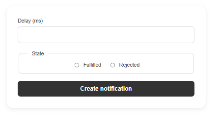

# JavaScript Homework: Asynchronous Features & UI Libraries

This project consists of two distinct JavaScript applications developed using **Vite**. The tasks demonstrate proficiency in handling asynchronous operations, managing the DOM, and integrating third-party libraries.

## 🚀 Overview

The repository showcases:

1.  **A Countdown Timer:** Uses `flatpickr` for date selection and custom logic for real-time UI updates.
2.  **A Promise Generator (Snackbar):** Simulates asynchronous success/failure states using standard Promises and customized `iziToast` notifications.

---

## 🛠 Tech Stack

- **Bundler:** [Vite](https://vitejs.dev/)
- **Libraries:** \* [flatpickr](https://flatpickr.js.org/) (Date & time picker)
  - [iziToast](https://izitoast.marcelodolza.com/) (Customized popup notifications)
- **Styling:** Custom CSS with a "Pinterest Aesthetic" (soft colors, rounded corners, and Montserrat font).

---

## 📂 Project Structure

```text
├── index.html           # Main entry point (if applicable)
├── 01-timer.html        # Timer task interface
├── 02-snackbar.html     # Promise task interface
├── css/
│   ├── timer.css        # Timer-specific aesthetic styles
│   └── snackbar.css     # Form & iziToast custom overrides
├── js/
│   ├── 01-timer.js      # Timer logic & flatpickr integration
│   └── 02-snackbar.js   # Promise logic & form handling
└── package.json         # Scripts and dependencies
```

---

## 🕒 Task 1: Advanced Countdown Timer

Located in `01-timer.html`, this application calculates the remaining time to a future event and updates the interface every second.

**Technical Highlights:**
**- Validation:** The "Start" button is only active when a future date is selected.

**- Date Manipulation:** Uses `flatpickr` to ensure a consistent cross-browser date selection experience.

**- Formatting:** Numbers are formatted using `padStart(2, "0")` to maintain a `00:00:00:00` layout.

**- Auto-Stop:** The countdown clears the interval once it reaches zero to prevent unnecessary calculations.

---

## 🍬 Task 2: Promise Generator (Snackbar)

Located in `02-snackbar.html`, this tool creates promises based on user-defined delays and states.

**- Technical Highlights:**
Custom Promises: Dynamically creates a `new Promise` that resolves or rejects based on radio button selection.

**- Aesthetic Customization:** `iziToast` has been heavily customized in `snackbar.css` to feature a modern, soft design with muted sage green and terracotta tones.

**- Chain Handling:** Utilizes `.then()` and `.catch()` for processing promise results and providing immediate visual feedback.

---

## 📸 Application Previews

|            Countdown Timer Task             |        Promise Generator (Snackbar)         |
| :-----------------------------------------: | :-----------------------------------------: |
|        |  |
| _Modern countdown interface with flatpickr_ |   _Custom styled iziToast notifications_    |

---

## ⚙️ Installation & Development

To run this project locally, follow these steps:

1. **Clone the repository:**

```bash
git clone [https://github.com/your-username/your-repo-name.git](https://github.com/your-username/your-repo-name.git)
```

2. **Install dependencies:**

```bash
npm install
```

3. **Start the development server:**

```bash
npm run dev
```

4. **Build for production:**

```bash
npm run build
```

---

## 👩‍💻 Author

**Halenur Gürel** _Homework Project – Asynchronous JavaScript & UI Library Integration_ 🚀 **[Live Demo](https://halenurgurel.github.io/goit-js-hw-10/)** 📍 **Tech Stack:** HTML5 · CSS3 · JavaScript (ES6+) · Vite · Flatpickr · iziToast  
🔗 [GitHub Profile](https://github.com/halenurgurel)

🎯 _“This project demonstrates how to handle complex asynchronous flows, manage local and future time states, and provide a polished user experience through custom-styled UI notifications and interactive elements.”_
